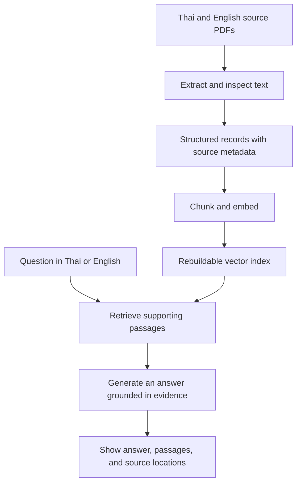

# Bilingual PDPA-RAG Engine

A Thai–English Retrieval-Augmented Generation (RAG) project exploring how to answer questions about Thailand's Personal Data Protection Act (PDPA) with traceable document evidence.

**Status: early development — source documents collected; implementation has not started.**

## Overview

Legal documents can be difficult to navigate, especially when a question and its supporting text are in different languages. This project aims to let users ask questions in Thai or English, retrieve relevant passages from the Thai act and its English translation, and inspect the evidence behind each answer.

The focus is a local, reproducible RAG baseline: preserve document provenance, evaluate retrieval across languages, and make insufficient evidence visible to the user.

## Target capabilities

The following capabilities are planned:

- **Bilingual questions:** accept questions in Thai and English.
- **Cross-language retrieval:** investigate whether questions in one language can retrieve relevant passages in the other.
- **Evidence-backed answers:** display supporting passages with source file, page, and section or article references when reliably available.
- **Clear source attribution:** distinguish the Thai source from the English translation throughout the pipeline and interface.
- **Insufficient-evidence handling:** state when the retrieved material does not support an answer.

## Current progress

| Area | Current state |
| --- | --- |
| Source documents | Thai and English PDFs stored in `Data/raw/` |
| Text extraction | Empty text placeholders prepared; extraction has not been run |
| Structured data | `Data/jsonl/` reserved for future records with provenance metadata |
| RAG pipeline | Planned; no chunking, embeddings, indexing, retrieval, or answer generation implemented |
| Application | Frontend and Backend directories prepared; frameworks not initialized |
| Evaluation | Experiment record format defined; no recorded experiments or benchmark results yet |

There is no runnable application or live demo at this stage. This repository currently documents the project scope, source material, and intended implementation approach.

## Planned architecture



Document preparation and indexing will be separate from per-question retrieval and answering. This allows extraction quality, retrieval behavior, and answer grounding to be evaluated independently.

### Intended stack

| Component | Planned technology |
| --- | --- |
| Frontend | React, TypeScript, Vite |
| Backend API | Python, FastAPI |
| Python environment and dependencies | uv |
| Reviewable intermediate data | Plain text and JSONL |
| Embedding model, generation model, and vector storage | Not selected yet |

The first milestone is a working local baseline. Containerization, cloud deployment, and MLOps will be considered after the pipeline and evaluation workflow are reproducible.

## Engineering focus

- **Extraction quality before indexing:** compare extracted text against the original PDFs, including Thai characters, article numbers, headings, and reading order.
- **Provenance through every stage:** retain language, source file, page, section or article, and text where extraction can establish them reliably.
- **Rebuildable indexes:** keep readable source data separate from generated vector indexes.
- **Measured experiments:** change one factor at a time and record inputs, settings, observed outputs, and limitations.
- **Separate retrieval and answer evaluation:** inspect whether the correct evidence was found before assessing how the answer uses it.

## Evaluation plan

The planned evaluation set will include Thai questions, English questions, cross-language retrieval cases, and questions with insufficient evidence in the source documents.

| Evaluation area | Question to investigate |
| --- | --- |
| Extraction | Are characters, document order, and article boundaries preserved? |
| Retrieval | Do retrieved passages contain the expected supporting article or section? |
| Answer grounding | Are answer claims supported by the retrieved passages? |
| Citations | Can a reader locate the cited evidence in the original document? |
| Insufficient evidence | Does the system clearly acknowledge missing support? |

Experiments will compare factors such as extraction method, chunk size, and the number of retrieved passages. Methods, observations, and conclusions will be recorded in [`experiments/`](experiments/README.md). Performance claims will be added only after measurements are recorded.

## Roadmap

- [x] Collect Thai and English source PDFs.
- [x] Define project scope, component boundaries, and experiment record format.
- [ ] Extract text and inspect representative pages against both PDFs.
- [ ] Produce structured records with language and source metadata.
- [ ] Implement a local retrieval and answer-generation baseline with citations.
- [ ] Build and run bilingual and cross-language evaluation cases.
- [ ] Record controlled experiments and document findings.
- [ ] Add a FastAPI service and a React interface for questions and evidence.

## Explore the repository

```text
.
├── Data/
│   ├── raw/          # Thai source PDF and English translation PDF
│   ├── extracted/    # Empty placeholders for extracted text
│   └── jsonl/        # Reserved for structured text and source metadata
├── Backend/          # Reserved for the data pipeline, RAG logic, and API
├── Frontend/         # Reserved for the question-and-evidence interface
├── experiments/      # Experiment record format; results to follow
├── agent-knowledge/  # Project context and design notes
└── README.md
```

To inspect the source material and project notes locally:

```bash
git clone https://github.com/Jsep09/Bilingual-PDPA-RAG-Engine.git
cd Bilingual-PDPA-RAG-Engine
```

Start with the PDFs in [`Data/raw/`](Data/raw/) and the [experiment guide](experiments/README.md). Installation and run instructions will be added when the application is implemented.

## Source documents

| Document | Local file | Source link |
| --- | --- | --- |
| Thai Personal Data Protection Act | [`PDPA (TH).pdf`](Data/raw/PDPA%20%28TH%29.pdf) | [Thai Parliament document](https://old.parliament.go.th/ewtadmin/ewt/elaw_parcy/ewt_dl_link.php?nid=2975) |
| English translation | [`PDPA (Eng).pdf`](Data/raw/PDPA%20%28Eng%29.pdf) | [Open Development Mekong document](https://data.opendevelopmentmekong.net/dataset/78c90118-6671-4c19-afe1-7bfbace4d46a/resource/ec616be5-9fbf-4071-b4b5-cb1f3e46e826/download/entranslation_of_the_personal_data_protection_act_0.pdf) |

The Thai document and English translation are kept as distinct sources. The planned system is an educational document-retrieval tool; its outputs should not be treated as legal advice.
